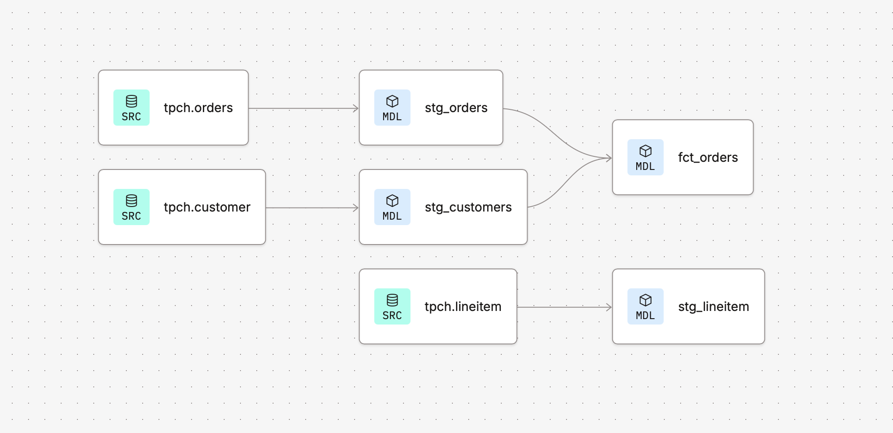

# Oracle to dbt Portfolio Project

Rebuilding Oracle-based reporting logic as modern dbt models on Snowflake — a hands-on project to bridge traditional Oracle SQL/OBIEE reporting with the modern data stack (dbt, Snowflake, GitHub).

## About this project

I'm a Senior BI Developer with a background in Oracle SQL, OBIEE, Tableau, and SAS, working on fleet leasing and insurance analytics. This project was built to demonstrate how the reporting logic I've traditionally built in Oracle translates into a modern, version-controlled, testable data pipeline using dbt and Snowflake.

## Tech stack

- **Snowflake** — cloud data warehouse (using the sample TPCH dataset)
- **dbt (Data Build Tool)** — SQL transformation, testing, and documentation
- **GitHub** — version control, pull requests, code review workflow

## Architecture

Raw source data flows through two layers:

**Staging layer** — light transformations (renaming, casting) directly on raw source tables:
- `stg_orders` — cleaned order-level data
- `stg_customers` — cleaned customer data
- `stg_lineitem` — cleaned order line-item data

**Marts layer** — business-ready models joining staging tables together:
- `fct_orders` — order fact table joining orders with customer details

This mirrors the traditional Oracle → staging tables → OBIEE reporting layer pattern, but with version control, automated testing, and reproducibility built in.

### Lineage graph

## Data quality tests

Each model includes automated tests to catch data issues early:
- `unique` and `not_null` checks on primary keys
- `relationships` tests to validate referential integrity between staging models

## How to run this project

1. Clone this repository
2. Set up a dbt Cloud project connected to your Snowflake account
3. Run `dbt run` to build all models
4. Run `dbt test` to validate data quality
5. Run `dbt docs generate` and `dbt docs serve` to view interactive documentation

## Why this project

Coming from an Oracle/OBIEE background, I built this project to close the gap toward modern cloud data stack skills — dbt, Snowflake, and Git-based workflows — as I target Senior BI Developer / Data Engineer roles in London.
